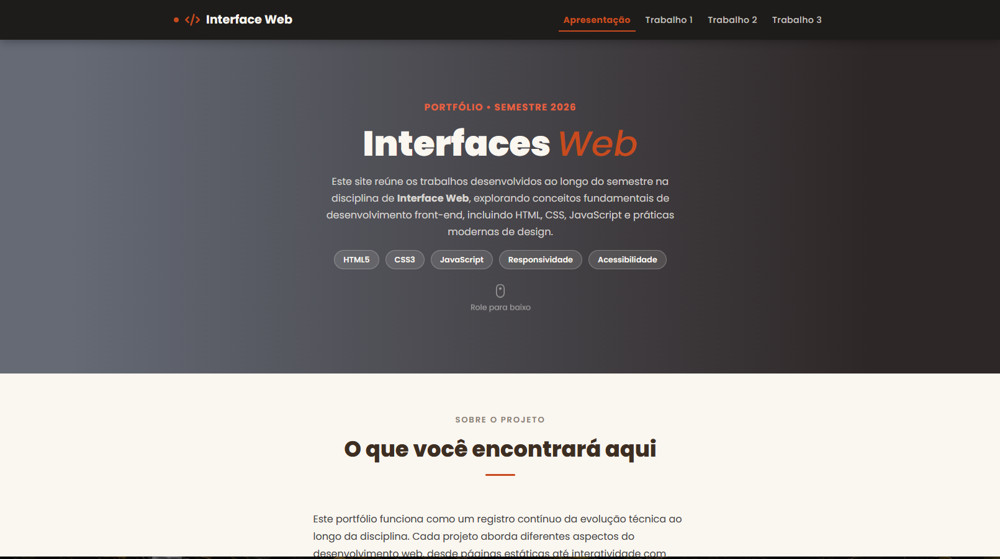
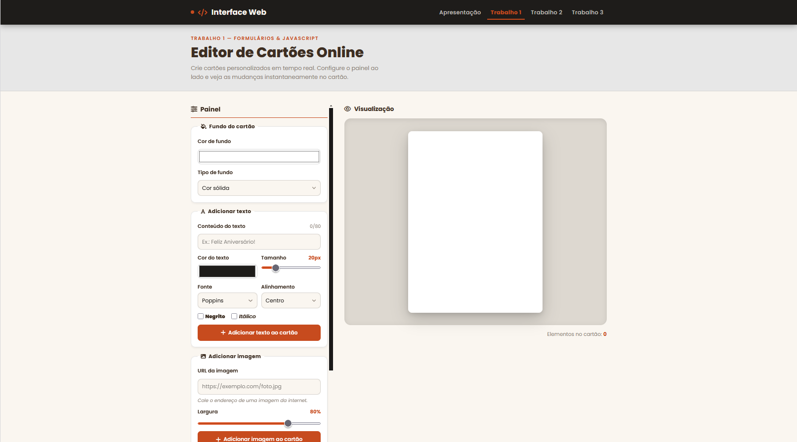

# 🖥️ Portfólio — Interface Web

> Site portfólio desenvolvido ao longo do semestre da disciplina de **Interface Web**, reunindo os trabalhos práticos em um único projeto coeso, com identidade visual consistente em todas as páginas.

[](#-demonstração)
[](#️-tecnologias-utilizadas)
[](#️-tecnologias-utilizadas)
[](#️-tecnologias-utilizadas)

---

## 📌 Sobre o Projeto

Este repositório contém as páginas desenvolvidas na disciplina de Interface Web (2026). Cada trabalho aborda um conjunto específico de tecnologias e conceitos do desenvolvimento front-end — desde estrutura semântica com HTML5 até interatividade avançada com JavaScript puro.

O site funciona como um **registro progressivo** da evolução técnica ao longo do semestre: novos trabalhos são adicionados à medida que a disciplina avança.

**Objetivos do projeto:**

- Praticar marcação semântica com HTML5
- Desenvolver identidade visual coerente com CSS3 e variáveis customizadas
- Criar interatividade com JavaScript puro, sem frameworks
- Aplicar boas práticas de acessibilidade e responsividade

---

## 🚀 Demonstração

🔗 **[Acesse o projeto ao vivo](https://SEU-LINK-AQUI)**


### Página de Apresentação



### Trabalho 1 — Editor de Cartões Online




---

## 📂 Estrutura de Pastas

```
index.html
README.md
📁 pages/
├── trabalho1.html         # Trabalho 1 — Editor de Cartões Online
├── trabalho2.html         # Trabalho 2 — (em breve)
├── trabalho3.html         # Trabalho 3 — (em breve) 
│
├── 📁 css/
│   ├── styles.css         # Estilos globais e sistema de design
│   └── stylesTrab1.css    # Estilos específicos do Trabalho 1
│
└── 📁 img/
    ├── web_dev_II.jpg     # Imagem da seção "Sobre"
    └── 📁 screenshots/    # Screenshots para o README 
```

---

## 🛠️ Tecnologias Utilizadas

| Tecnologia | Versão | Uso |
|---|---|---|
| HTML5 | — | Marcação semântica (`header`, `main`, `section`, `article`, `footer`) |
| CSS3 | — | Variáveis customizadas, Flexbox, Grid, animações, responsividade |
| JavaScript | ES6+ | Manipulação do DOM, eventos, validação de formulários |
| [Font Awesome](https://fontawesome.com/) | 6.7.2 | Ícones da interface |
| [Google Fonts — Poppins](https://fonts.google.com/specimen/Poppins) | — | Tipografia |

> Nenhum framework ou biblioteca JS foi utilizado — o objetivo é dominar a base da linguagem.

---

## 💻 Como Rodar Localmente

Nenhuma dependência ou etapa de build necessária — o projeto é HTML/CSS/JS puro.

**Opção 1 — Live Server (recomendado)**

```bash
# 1. Clone o repositório
git clone https://github.com/Dev-Lucius/repositorio_web

# 2. Abra a pasta no VS Code
cd repositorio_web && code .

# 3. Clique com o botão direito em index.html → "Open with Live Server"
```

> Instale a extensão [Live Server](https://marketplace.visualstudio.com/items?itemName=ritwickdey.LiveServer) caso ainda não tenha.

**Opção 2 — Abrir direto no navegador**

```bash
git clone https://github.com/Dev-Lucius/repositorio_web
# Abra o arquivo index.html diretamente no navegador
```

> ⚠️ Abrir via `file://` pode causar problemas com caminhos relativos de CSS e imagens. Prefira o Live Server.

---

## 🎨 Sistema de Design

Todas as páginas compartilham o mesmo conjunto de variáveis CSS definidas em `styles.css`, garantindo consistência visual sem repetição de código.

```css
:root {
    --cream:      #faf6f0;  /* fundo das páginas          */
    --charcoal:   #1e1c1a;  /* header e fundos escuros    */
    --rust:       #c74b1e;  /* cor de destaque principal  */
    --brown:      #3d2e22;  /* títulos e textos de ênfase */
    --muted:      #8a7f75;  /* textos secundários         */
    --rust-light: #e86040;  /* hover e acentos            */
    --sage:       #4e7a52;  /* status "concluído"         */
}
```

---

## 📄 Licença

Este projeto é de uso **acadêmico**, desenvolvido para fins educacionais na disciplina de Interface Web.
